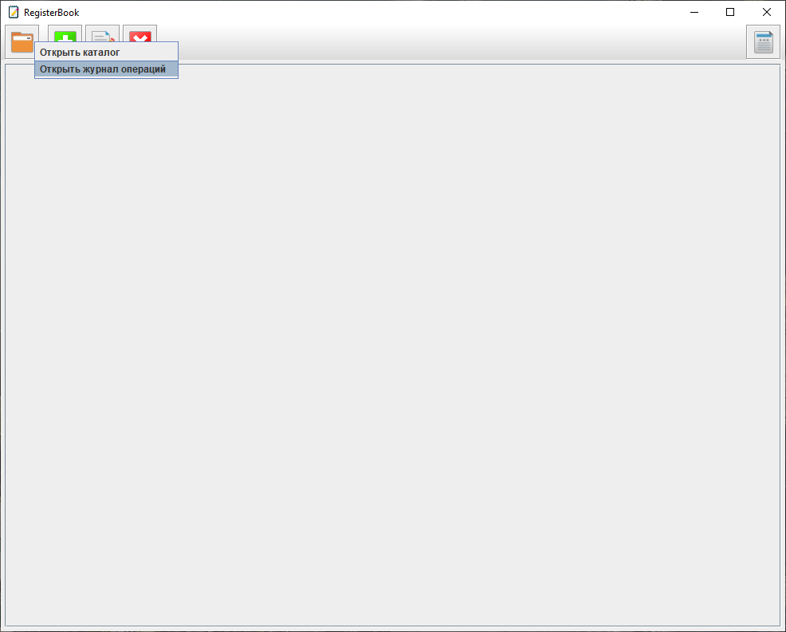
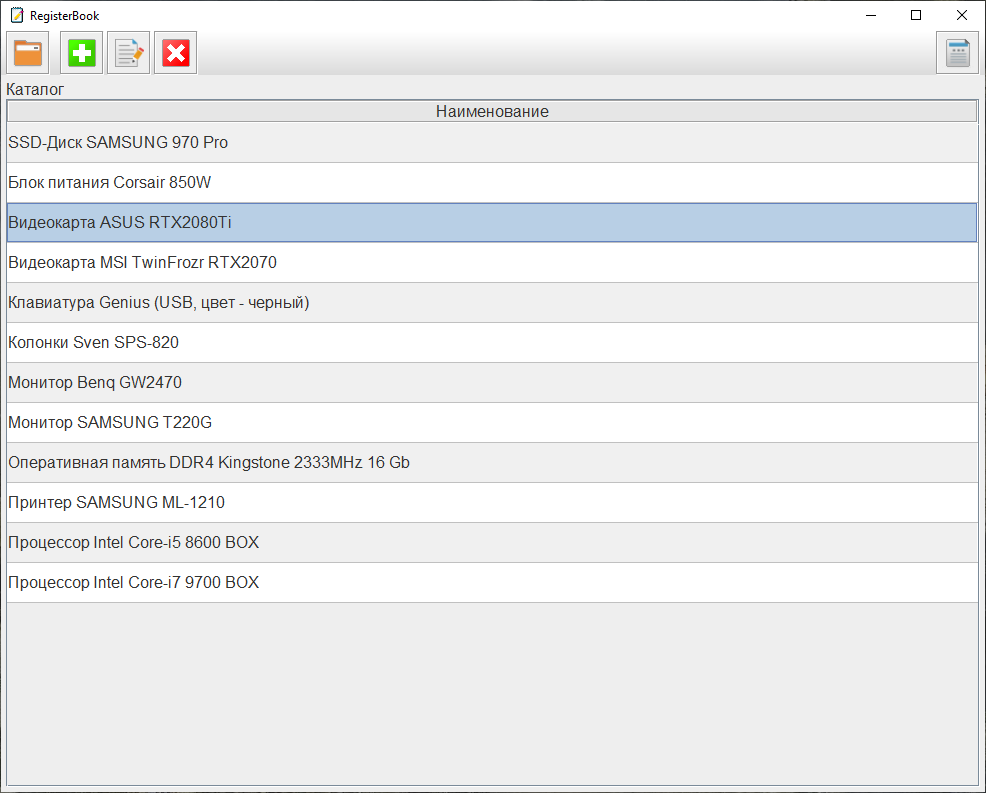
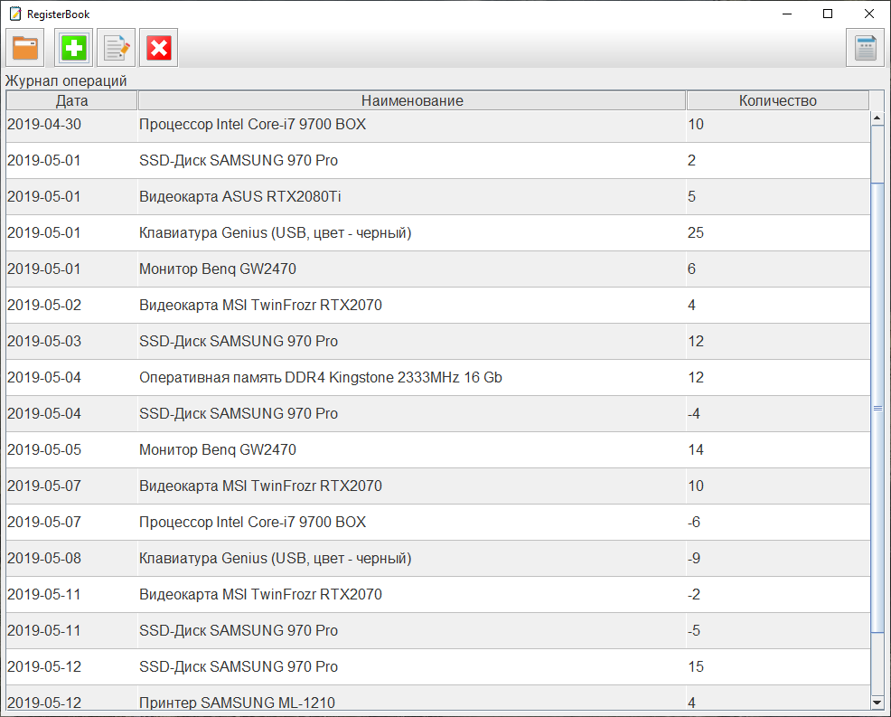
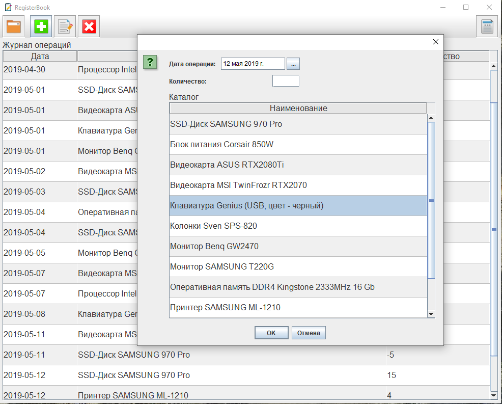
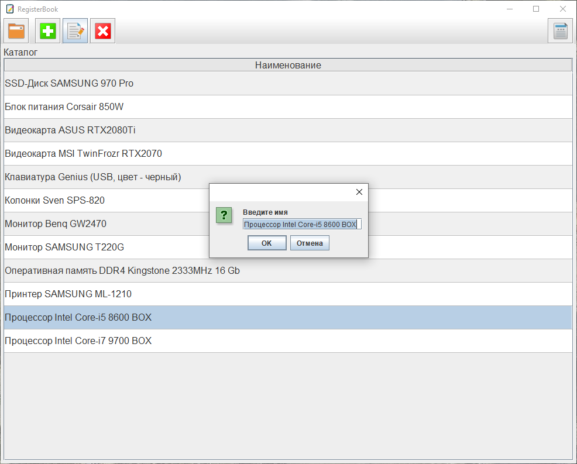
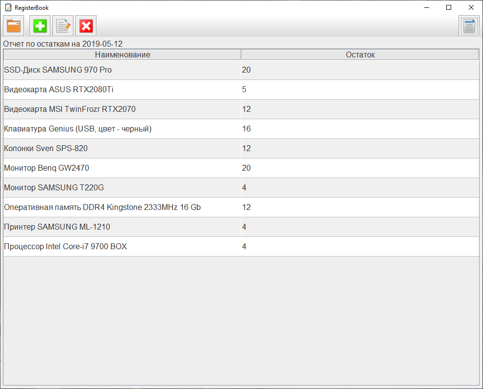
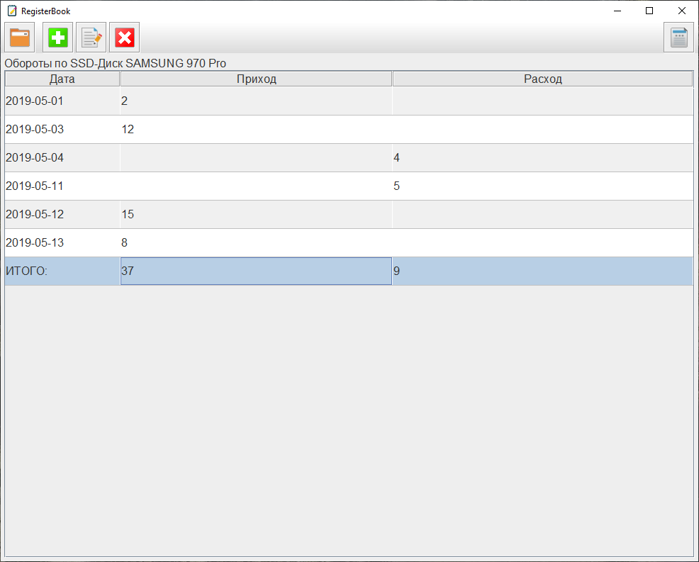

# RegisterBook

Данный проект - эксперимент по работе с базой данных. Приложение представляет собой своего рода простую модель программы по учету
неких единиц номенклатуры, которыми могут быть товары, запасные части и т.п. То есть всё, что могло бы храниться на каком-то складе и 
учитываться по количеству.
База данных приложения (здесь я снова использую СУБД SQLite) имеет две таблицы - CATALOG - по сути номенклатура, и OPERATIONS - операции 
с этой номенклатурой: приходные и расходные.

Состав классов:
1. MainClass - класс, с которого начинается выполнение. В нем создается экземпляр класса DBHandler и запускается GUI.

2. Класс DBHandle. Данный класс инкапсулирует все операции с базой данных. Весь SQL-код выполняется в нем. Для получения различных 
элементов БД (таблиц, отчетов на их основе) и для записи в БД в нем предусмотрены отдельные методы.

3. Классы пакета table_component. Классы данного пакета необходимы для отображения таблиц базы данных в главном окне и диалоговых окнах
   приложения. 
   DTablePane - класс, который создает таблицу и связывает ее с моделью данных (экземпляром класса DTableModel). 
   DTableCellRenderer, DTableHeaderRenderer - рендереры для ячеек таблицы и заголовков столбцов.
   DTableContent - класс экземпляр которого хранит текущее содержимое таблицы, а также информацию о вспомогательных элементах, таких как,
   например, имена столбцов.

4. ResourcesList - класс, предназначенный для хранения ресурсов приложения. По сути, этот класс - набор констант.

5. ActionHandler - класс, реализующий логику работы приложения. В него вынесены все обработчики событий от элементов интерфейса.
   Также он содержит методы для формирования всех диалоговых окон (подобно, например, классу JOptionPane библиотеки Swing).
   
   Ниже - скриншоты приложения.
   
   
   
   
   
   
   
   
   
   
   
   
   
   
